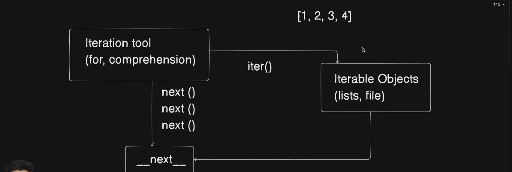

- python meh ek iter tool banaya tha jiske andar for , comprehension , while , do while yeh saare iteration tools hote hai  
- iteration keh tools sirf unhe par kaam asakte hai joh chize iterable ho python meh inhe iterable objects kehte hai e.g. list , file 
- abh jabh hum iterable operation perfrom karte hai python meh iterable objects par toh hame response milta hai jiseh __next__ or next() handle karta hai 
- iterable tool query karte hai iterable object seh keh we have to implement a loop on you iske liye iterable tool ek iter() method bhejta hai iterable object keh paas
- toh jabh iterable tool iter() method bhejta hai iterable object keh paas toh iterable object usko sirf yeh return nahi karta hai keh aap loop lagah sakte ho object par vo sabse pehle memory address return karta hai useh object kah sath meh vo __next__ / next() return karta hai
- basically next() keh andar information hote hai next address keh jiseh iteration tool koh patah chalta repta hai keh abhi iteration objects meh aur values bhi hai 
- jabh last iteration object meh last iteration aati hai tabh next ek exeption raise karta hai stop iteration exception and jiske baad iteration ruk jaati hai 
- jabh tak yeh exeption nahi aati tabh tak iteration tool next() seh iteration karta rehta hai 
- python meh ham kise bhi object(list, set, dictionary,tuple,file ) koh iterable bana sakte hai yaah non iterable bana sakte hai yeh depend karega keh kya uske paas __next__ object hai keh nahi  
  