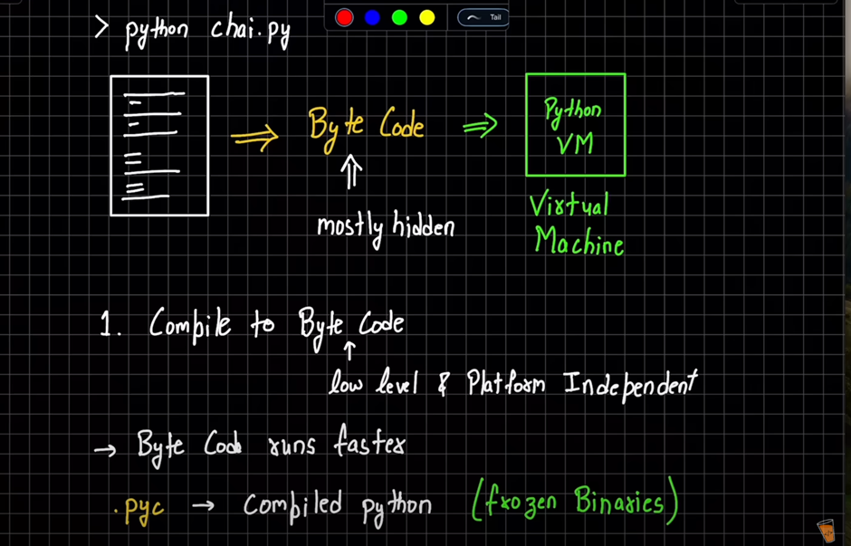
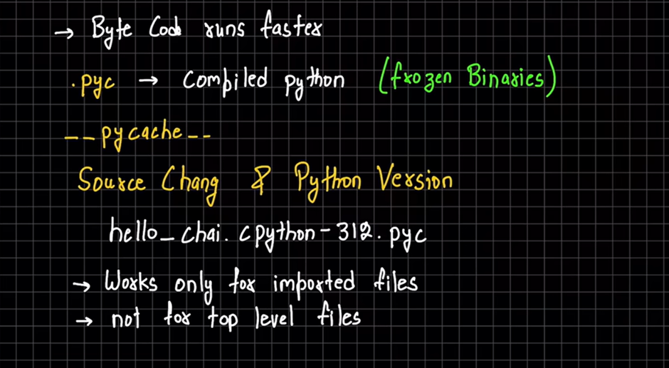
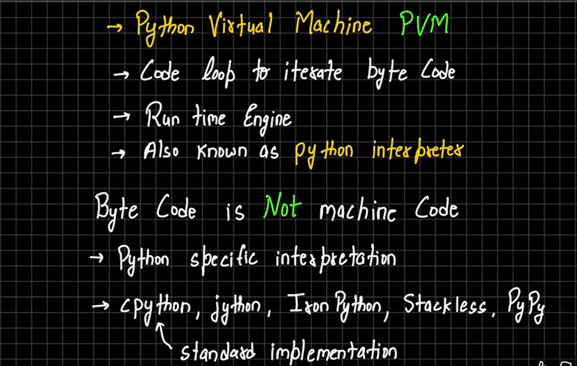
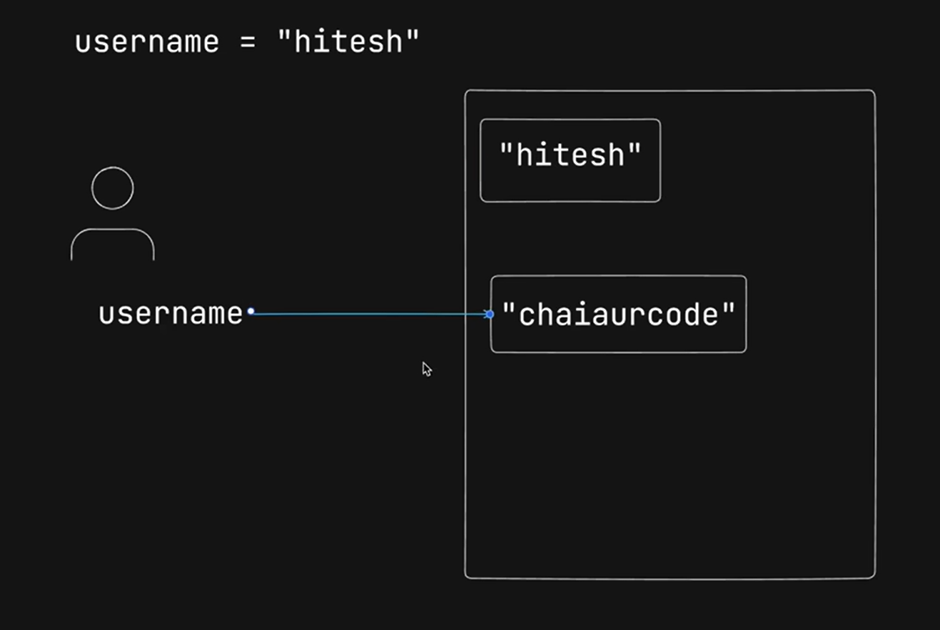
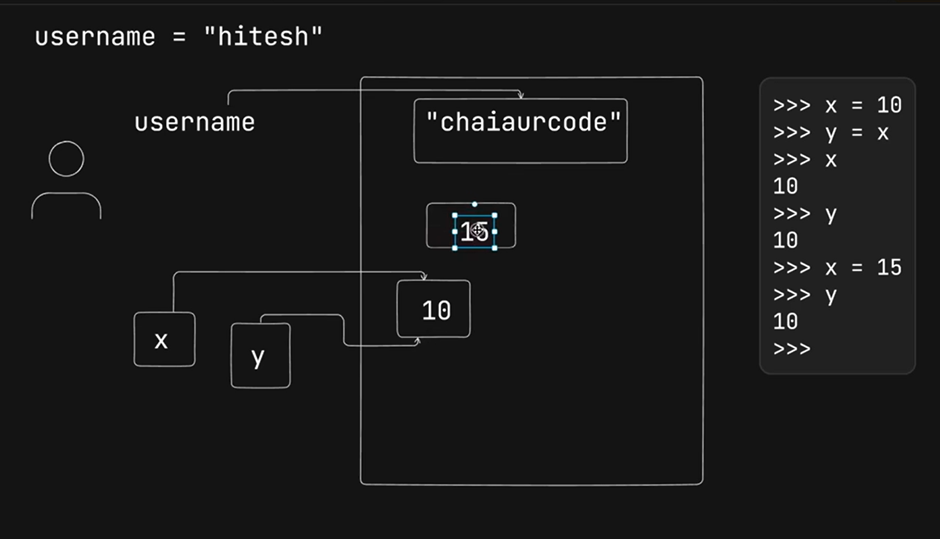
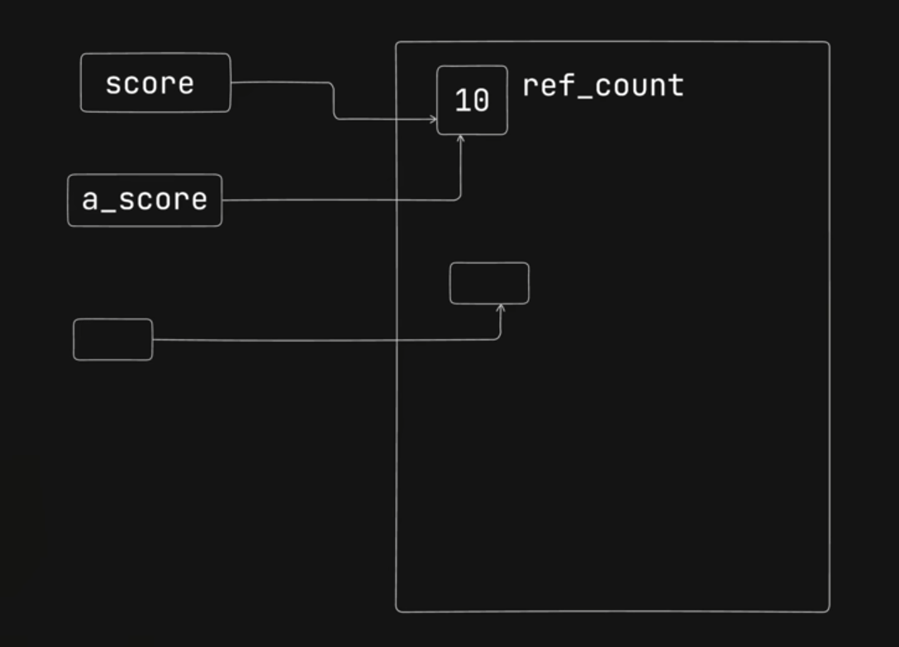
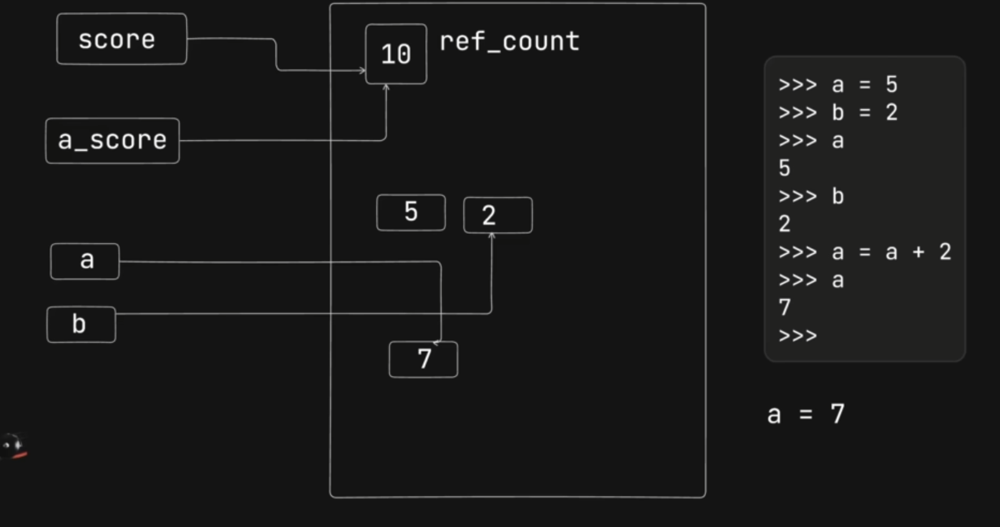

Python Working and Notes
 

->	   
  

->Python virtual  machine(PVM)

 

	Java is considered a compile language and python is not considered a compile language because java meh hame explicitly file koh compile karna tha and infront of us hum useh .java seh .class meh convert hote huye dekh sakte hai par python  meh hame explicity compile nahi karna padhta .pyc(frozen binary) meh vo ek background process and its not mandatory to convert to byte code because if there is  only a top level file(only 1 file which is executing there is no import used)  than python virtual machine can directly run the file.

	Python Shell:- so agar hame python shell use karna hai usko hum python keyword terminal seh start kar sakte hai  and idhar hum apni testing kar sakte hai  by using variables ,function calling and loop and also we can import different modules in the python shell via import statement 

** so basically to reload the imports agar hamare changes dynamic hore hai useh module meh to hum importlib seh reload import kar skate hai and with reload() hum useh module koh call kar sakte hai  syntax- from importlib import reload
    reload(module_name)
**

->  Mutable and Imutable in python:- 
so basically jabh bhi hum mutable aur e mutable types keh baat karte hai python meh toh uska matlab yeh hota hai keh agar e.g hame ek variable liya usme pehle save kiya name = ”piyush” and uske baad hamne name = ”Piyush Sharma ” kardiya toh agar variable imutable type hai toh basically name joh hai vo Piyush vale memory block koh point naah karke Piyush Sharma wale memory block koh point Karega  joh memory block hai  jisme  Piyush hai hum usme changes nahi kar sakte 
but agar datatype mutable hogi toh hum useh memory block keh andar keh data koh change kar sakte hai  also hum useh variable meh dusri value bhi store kar sakte hai 

So in the nutshell mutable and immutable  meh difference yeh hai keh hum immutable  datatype meh different memory block koh  refer kara sakte hai apne variable koh  par useh memory block keh andar meh data koh change nahi kar sakte hai Par mutable datatype meh hum different memory block koh toh refer karva hi sakte hai apne variable koh sath hi sath useh memory  block keh andar keh data koh vi change kar sakte hai 

 

Toh basically jabh koi bhi reference variable useh memory block koh refer nahi kar raha hoga to garbage collector useh memory block koh clean kar dega 

       
     x = 10  
    y  = x  
     x = 15  
     print( x,y )  

so basically  yaha par output  y =10 aayega iska reason yeh hai keh pehle y=x meh y and x dono 10 koh refer kar rahe theh jabh hamne x =15 kiya toh  x neh 15 koh refer karna shuru kardiya par y toh tabh bhi 10 koh hi refer kar raha tha so that’s why x meh 15 aayega and y meh 10 

- ***In Python if we want to know about any method and sub features that method provides we can use the Dir() method*** 

- the datatype of value stored in a variable hamseha memory block keh paas rahegi python meh kabhi bhi variable keh paas nahi jaayegi 
- python meh har ek memory block  kah ref_count hota hai
- agar ek memory block keh upar seh variable remove kar dete hai toh python meh vo memory block keh andar keh value koh garbage collector remove kardeta hai par in case the value in a memory block is a string or a number garbage collector imidately memory block seh value nahi remove karega

-python meh jaha kah bhi reference hota hai calculation seh pehle waha keh saari value unke reference meh aajati hai 
jabh calculation puri hojati hai tabh ek naya memory block create hota hai jisme useh calculation kah result store hoga and than the variable which was assigned the value of calculation koh variable useh memory block koh point karega

>>> l1 =[1,2,3]  

>>> l2 = l1  

>>> l1  
[1, 2, 3]  
>>> l2  
[1, 2, 3]  
>>> l1[0] = 44  
>>> l1  
[44, 2, 3]
>>>
>>> l2   
[44, 2, 3]  

>>> p1 = [1,2,3]  
>>> p2 = p1     
>>> p2 = [1,2,3]
- yaha par above given code meh jabh ham l2 koh l1 keh equal kar rahe hai tabh ek hi memory block banraha hai jisko dono l1 and l2 refer kar rahe hai toh agar hum l1[0] =44 kar rahe hai basically useh list par operation perform kar rahe hai toh because l1 and l2 same memory block koh refer kar rahe hai agar hum l2 koh print karenge toh changes usme bhi show honge and in case of p1 and p2 jese hi hame p2 keh andar koi value assign kari balahe hi vo value same ho ek naya memory block create hua p2 jisko abh point karega and agar hum koi bhi changes karenge p1 meh vo p2 meh reflect nahi honge

- in case of below example taki h1 and h2 dono same hi memory block koh refer nah kare rather than using h2=h1 ham yaha par h1 meh starting seh end tak slicing seh store karange basically ek aur memory block meh h1 keh memory block keh copy banadenge jiko h2 point karega 
>>>h1 = [1,2,3]  
>>> h2 = h1[:]  
>>> h1  
[1, 2, 3]  
>>> h2  
[1, 2, 3]

- to check keh dono same memory block koh refer kar rahe hai keh nahi ham is operator use kar kar sakte hai python meh 
e.g  
m=[1,2,3]  
n = m  
m==n  
True  
m is n   
- Numbers:  
  a)   
  

