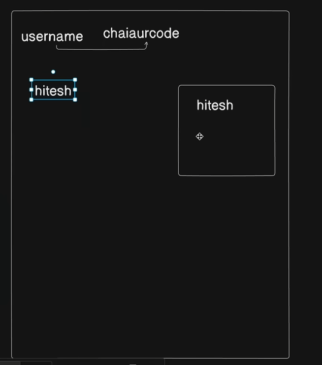
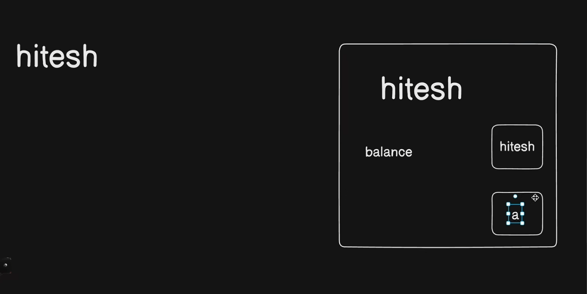
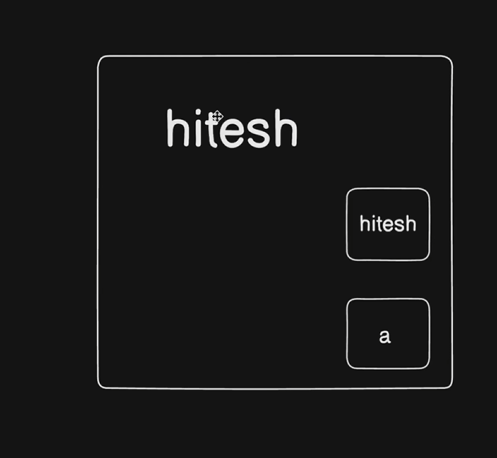

- mostly jaada tar languages meh {} curly braces kah matlab hota hai scope
- but python meh scopes : keh baad indetation seh denote hote hai
- basicallly joh element same indentation meh hote hai unka scope same hota hai

- So basic concept scope kah yeh hai  keh scope basically ek ghar hai joh python meh :  colon keh baad indentation seh define hota hai basically functions and conditonals meh iska use hota hai 
-  toh agar hamne koh bhi variable : keh baad indentation keh andar define kara hai vo hi same naam seh variable useh loop yah function keh bahar bhi defined hai toh toh
indetation keh andar agar koi operation perform hora hai joh useh variable keh upar hora hai toh  indentation keh andar wala variable utilise kara jayega
-  agar hum function keh scope seh bahar wale variable koh manupulate karna chate hai toh hame global keyword use karna padega
